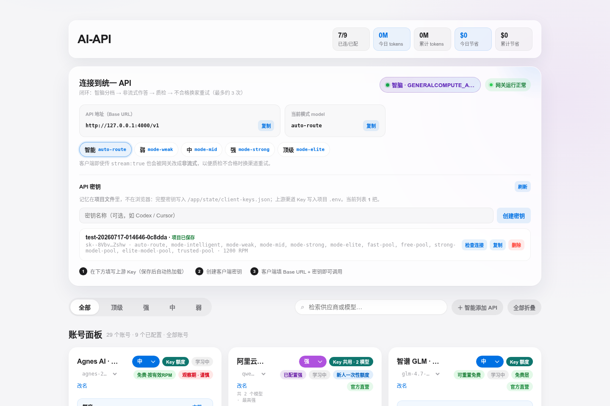
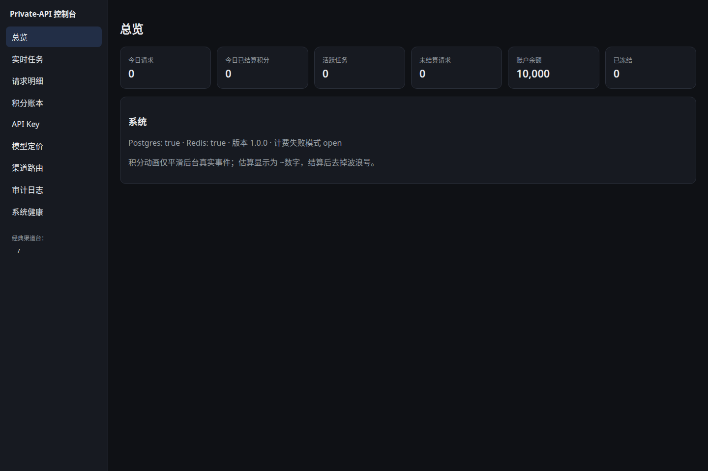
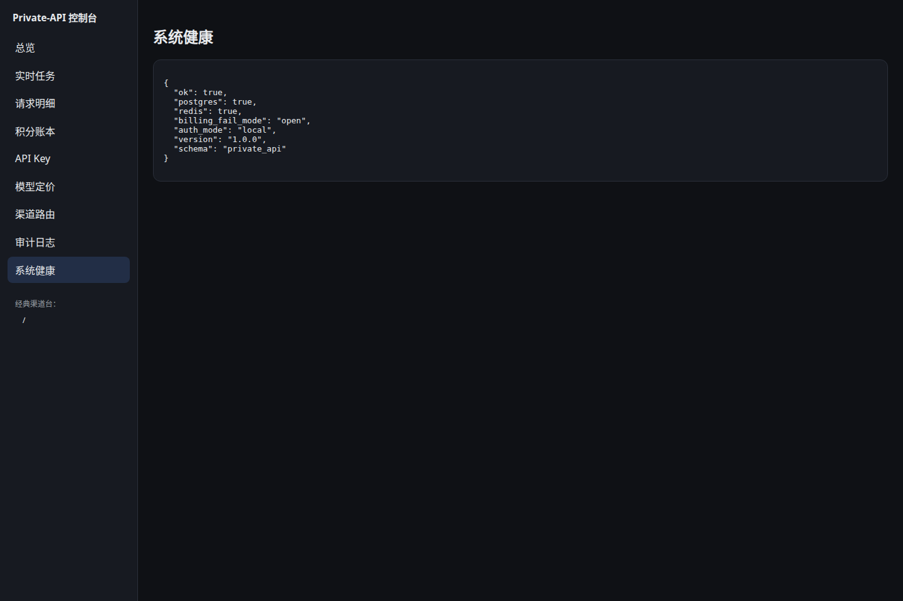
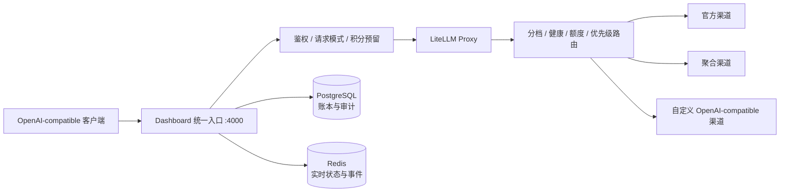

<p align="center">
  
</p>

<h1 align="center">AI Gateway Matrix</h1>

<p align="center"><strong>把分散的 LLM 渠道，收进一个 OpenAI-compatible API。</strong></p>

<p align="center">本地部署 · 智能分档 · 故障换路 · 中文控制台 · 用量与积分账本</p>

<p align="center">
  
  
  
  
</p>

<p align="center">
  <a href="#快速开始">快速开始</a> ·
  <a href="#第一次调用">第一次调用</a> ·
  <a href="#路由模式">路由模式</a> ·
  <a href="#日常运维">运维</a> ·
  <a href="#本地开发">开发</a>
</p>



AI Gateway Matrix 是一个面向个人开发者和小团队的本地优先 LLM 网关。你可以接入多个官方或聚合渠道，对客户端只提供一个标准 OpenAI API；网关再根据任务强度、渠道健康、额度与优先级选择模型，失败时自动切换可用路径。

它不试图替代大型企业 API 管理平台。它解决的是一个更具体的问题：

> 手里有多组 LLM API Key，能力、额度和稳定性各不相同，怎样让 Codex、Cline、Roo Code 或自己的程序只连接一个地址，并尽量把每个渠道用在合适的位置。

## 为什么用它

| 能力 | 你得到什么 |
|---|---|
| 一个兼容端点 | 客户端统一连接 `http://127.0.0.1:4000/v1`，不再逐个适配供应商 |
| 智能任务分档 | 按弱、中、强、顶级四档选择模型；也可以固定档位，行为可预测 |
| 失败自动换路 | 渠道超时、限流或回答质检失败时，冷却异常节点并尝试同档候选 |
| 渠道控制台 | 填写 Key、调整优先级与档位、检查余额和连接状态 |
| 账本与审计 | PostgreSQL 保存请求、积分、任务和审计数据，Redis 承担实时状态 |
| 本地优先 | 管理入口默认只监听 `127.0.0.1`，Key 与数据库都留在用户数据目录 |
| 可迁移 | 一条命令备份或恢复配置、Key、Redis 与 PostgreSQL 数据 |

### 适合

- 给 Codex、Cline、Roo Code、Cursor 或内部工具提供统一模型入口
- 混合使用免费层、试用额度、付费渠道与聚合渠道
- 在个人电脑或可信内网主机上自托管
- 需要中文渠道管理、请求明细、积分账本和健康检查

### 不适合

- 未经加固就直接暴露到公网
- 把免费/试用渠道当作有 SLA 的生产基础设施
- 要求跨地域高可用、Kubernetes 编排或完整企业治理的超大规模部署

## 界面

以下截图来自本仓库 `1.0.0` 在本机 Docker Compose 中的真实运行实例，不是设计稿。

### 专业控制台

请求、任务、积分、API Key、定价、审计和系统状态集中在 `/console`。



### 运行状态

健康页直接检查 PostgreSQL、Redis、认证模式、账本 schema 和当前版本。



## 快速开始

### 1. 准备环境

当前推荐在 Linux 上运行：

- Docker Engine
- Docker Compose v2
- Git

确认 Docker 可用：

```bash
docker info
docker compose version
```

### 2. 启动

```bash
git clone https://github.com/dell121212/Private-API.git
cd Private-API
./run.sh start
```

首次启动会：

1. 在仓库根目录创建 `home/` 用户数据目录；
2. 自动生成网关、Redis 和 PostgreSQL 的内部密钥；
3. 拉取并构建所需容器；
4. 等待全部服务通过健康检查。

启动完成后打开：

| 地址 | 用途 |
|---|---|
| `http://127.0.0.1:4000` | 经典渠道台：添加上游 Key、调整路由、创建客户端 Key |
| `http://127.0.0.1:4000/console` | 专业控制台：任务、请求、积分、审计与健康 |
| `http://127.0.0.1:4000/v1` | OpenAI-compatible API Base URL |
| `http://127.0.0.1:8080` | 兼容旧书签，与 `4000` 指向同一个 Dashboard |

### 3. 接入第一个渠道

进入 `http://127.0.0.1:4000`：

1. 在账号面板选择一个供应商；
2. 填入自己的上游 API Key 并保存；
3. 点击“创建密钥”，生成给客户端使用的网关 Key；
4. 将页面显示的 Base URL、Key 和模型名填入客户端。

上游 Key 与客户端 Key 是两类凭据：

- **上游 Key**：供应商签发，网关用它请求模型。
- **客户端 Key**：本项目签发，Codex、Cline 或你的程序用它访问网关。

## 第一次调用

将 `sk-your-client-key` 替换为控制台创建的客户端 Key。

### cURL

```bash
curl http://127.0.0.1:4000/v1/chat/completions \
  -H "Authorization: Bearer sk-your-client-key" \
  -H "Content-Type: application/json" \
  -d '{
    "model": "auto-route",
    "messages": [
      {"role": "user", "content": "用三句话解释什么是幂等性"}
    ],
    "stream": false
  }'
```

### OpenAI Python SDK

```python
from openai import OpenAI

client = OpenAI(
    api_key="sk-your-client-key",
    base_url="http://127.0.0.1:4000/v1",
)

response = client.chat.completions.create(
    model="auto-route",
    messages=[
        {"role": "user", "content": "为一个订单 API 设计重试策略"},
    ],
)

print(response.choices[0].message.content)
```

任何支持自定义 OpenAI Base URL 的客户端都可以按同样方式接入。

## 路由模式

| 模型名 | 行为 | 典型任务 |
|---|---|---|
| `auto-route` | 智能判断任务强度后选择档位 | 默认推荐 |
| `mode-weak` | 固定走弱档 | 分类、提取、短摘要 |
| `mode-mid` | 固定走中档 | 写作、翻译、普通编程 |
| `mode-strong` | 固定走强档 | 代码分析、多约束任务 |
| `mode-elite` | 固定走顶级档 | 长上下文、复杂推理、项目规划 |

智能模式的核心路径是：

```text
任务进入
   │
   ├─ 敏感信息规则命中 ─────────────→ trusted-pool
   │
   └─ 本地规则 / 智能分诊判断复杂度
                 │
                 ├─ 弱 → fast-pool
                 ├─ 中 → free-pool
                 ├─ 强 → strong-model-pool
                 └─ 顶级 → elite-model-pool
                              │
                              └─ 健康、额度、优先级、冷却状态共同选路
```

需要精确控制时，用固定档位；希望客户端只配置一个模型名时，用 `auto-route`。

### 严格模式与 Agent 流式模式

可用请求头覆盖默认模式：

```http
X-PrivateAPI-Mode: strict
```

| 模式 | 流式行为 | 适合 |
|---|---|---|
| `strict` | 网关可转为非流式，以便完成回答质检与换路 | 普通问答、报告、结果优先 |
| `agent-stream` | 保留流式响应，异常时记录和冷却，不拼接多次输出 | Codex、Cline、Roo Code 等 Agent |

## 工作原理



主要组件：

| 组件 | 职责 |
|---|---|
| LiteLLM | OpenAI 协议兼容、供应商适配与基础路由 |
| `gateway/` | 任务分档、配额、质量检查、冷却与自动修复 |
| FastAPI Dashboard | 管理 API、透明代理、鉴权、账本与实时任务 |
| React Console | 专业控制台 |
| PostgreSQL | 用户、请求、积分流水、定价与审计真账 |
| Redis | 渠道状态、用量聚合、实时事件与临时协调 |

## 数据与安全

源码模式下，程序与用户数据分离：

```text
Private-API/
├── app/                    # 程序代码
├── home/                   # 本机数据，已 gitignore
│   ├── .env                # 上游 Key 与内部密钥
│   ├── config.yaml         # 渠道与路由配置
│   ├── provider_manifest.yaml
│   ├── state/
│   └── data/
│       ├── postgres/
│       └── redis/
├── run.sh
└── README.md
```

默认安全边界：

- Dashboard 端口只绑定 `127.0.0.1`。
- `.env`、`home/`、`jiyi.txt` 和运行状态不会进入 Git。
- 容器启用 `no-new-privileges`，Dashboard 与巡检服务移除 Linux capabilities。
- 默认不保存 Prompt 正文；开启 `STORE_PROMPT_CONTENT=true` 前请先评估隐私风险。
- 请求仍会发送给你配置的第三方模型供应商；“本地部署”不等于“Prompt 永不离机”。

### 认证模式

| `DASHBOARD_AUTH` | 用途 |
|---|---|
| `local` | 默认；仅本机访问时免登录 |
| `token` | 使用独立 Dashboard Token |
| `accounts` | Argon2 密码、HttpOnly Session Cookie、CSRF 与 RBAC |

如果要通过反向代理或局域网开放服务，至少应：

1. 使用 HTTPS；
2. 将 `DASHBOARD_AUTH` 改为 `token` 或 `accounts`；
3. 限制来源 IP；
4. 使用防火墙保护宿主机；
5. 将严格计费场景的 `BILLING_FAIL_MODE` 改为 `closed`。

> 默认 `BILLING_FAIL_MODE=open` 以保证个人网关在账本暂时不可用时仍能调用模型。它不适合“账本失败就必须拒绝请求”的收费服务。

修改 `home/.env` 后重启：

```bash
./run.sh restart
```

## 日常运维

```bash
./run.sh status                 # 容器与健康状态
./run.sh logs --tail=200        # 最近日志
./run.sh logs -f                # 持续跟踪日志
./run.sh restart                # 重启
./run.sh stop                   # 停止全部服务
./run.sh home                   # 打印用户数据目录
./run.sh version                # 当前版本
```

### 备份与恢复

```bash
./run.sh backup ~/agm-backup.tgz
./run.sh restore ~/agm-backup.tgz
./run.sh start
```

备份包含 `.env`、配置、状态、Redis 和 PostgreSQL 数据。归档内含 API Key，应像密码文件一样保管。

也可以使用单文件记忆：

```bash
./run.sh jiyi save
./run.sh jiyi load
./run.sh jiyi list
```

`jiyi.txt` 同样包含敏感信息，默认权限为 `0600`，且禁止提交到 Git。

更完整的迁移说明见 [PORTABLE_DATA.md](./app/docs/PORTABLE_DATA.md)。

## 本地开发

### 后端

```bash
python3 -m venv .venv
. .venv/bin/activate

pip install \
  -r app/requirements.txt \
  -r app/requirements-dev.txt \
  -r app/dashboard/requirements.txt

cd app
pytest tests/billing tests/test_run_script.py -q
ruff check gateway dashboard scripts tests
```

### 前端

```bash
cd app/dashboard/frontend
npm ci
npm test
npm run build
```

生产构建输出到 `app/dashboard/frontend/dist/`，Dashboard 会把它挂载到 `/console`。

### 仓库结构

```text
app/
├── dashboard/
│   ├── app/               # 模块化 FastAPI 后台、数据库与账本
│   ├── frontend/          # React + Vite 专业控制台
│   └── backend.py         # 经典渠道台与统一代理入口
├── gateway/               # 路由、配额、质检、健康与自动修复
├── scripts/               # 配置校验、健康检查、巡检与对账
├── tests/                 # 单元、集成与计费测试
├── packaging/             # Debian 打包
├── desktop/               # 桌面入口
└── docker-compose.yml
```

## Debian 打包

```bash
bash app/packaging/release-deb.sh
```

产物位于 `app/dist/`。安装版把程序放在 `/usr/share/ai-gateway-matrix`，把可迁移用户数据放在 `~/.config/ai-gateway-matrix`；升级程序不会覆盖用户 Key 与数据库。

详见 [打包说明](./app/packaging/README.md)。

## 项目边界

- 渠道的免费额度、模型名和服务政策会变化，上线前请自行核对供应商条款。
- 自动路由提高可用性，不等于提供服务等级承诺。
- 质量检查只能发现部分明显问题，不能保证模型回答正确。
- 多账号叠加额度可能违反供应商条款，本项目不鼓励绕过限额。
- 公网、多租户或收费部署需要额外的 TLS、监控、备份、限流和安全审计。

## 技术基础

本项目建立在 [LiteLLM](https://github.com/BerriAI/litellm)、[FastAPI](https://github.com/fastapi/fastapi)、[React](https://github.com/facebook/react)、[PostgreSQL](https://www.postgresql.org/) 与 [Redis](https://redis.io/) 之上。

## License

[MIT](./LICENSE)
